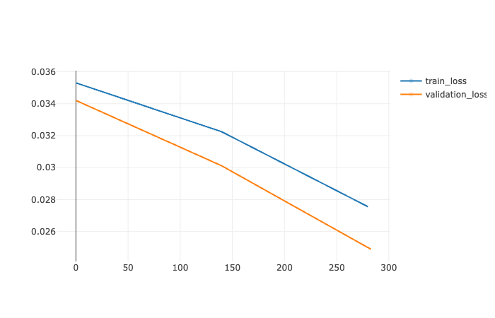
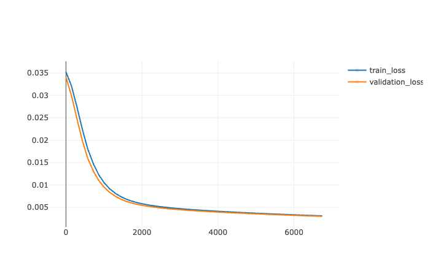
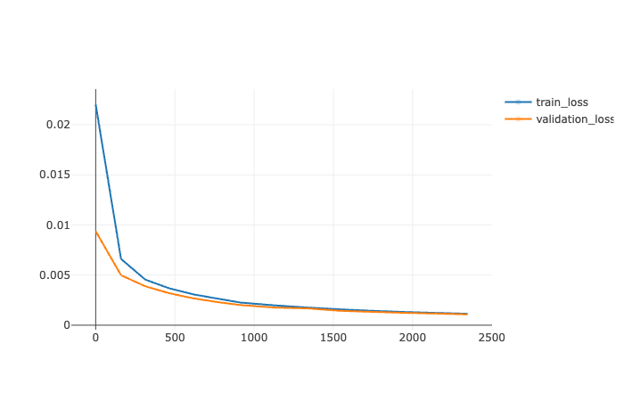
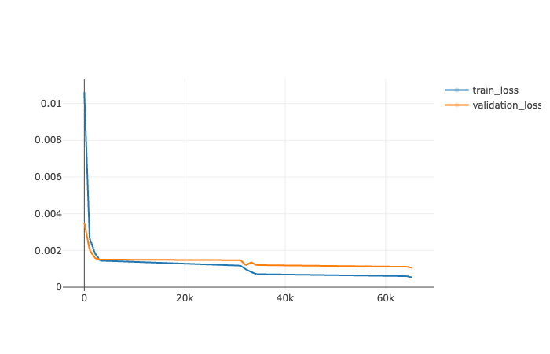
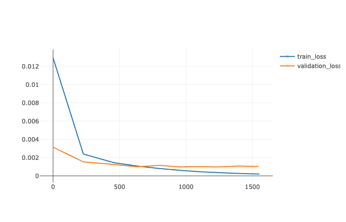
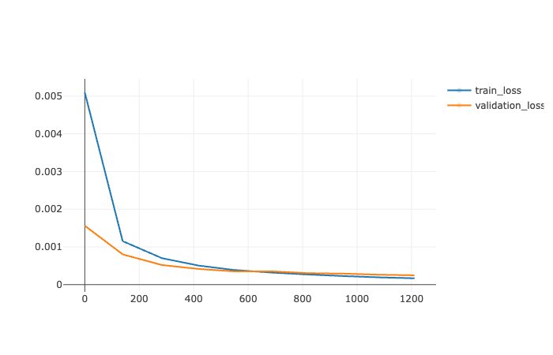
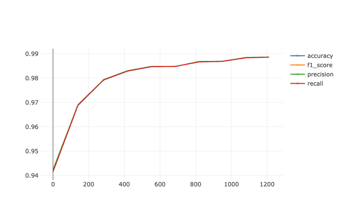

# Lunit Project

This project provides utilities for training neural networks on the [MNIST dataset](https://paperswithcode.com/dataset/mnist) , running inferences, and tracking experiments using [MLFlow](https://mlflow.org/docs/latest/tracking.html). We make accessible two different models, on [SimpleConvNet](https://github.com/pytorch/examples/blob/main/mnist/main.py) and one [ViT](https://github.com/UdbhavPrasad072300/Transformer-Implementations/blob/main/notebooks/MNIST%20Classification%20-%20ViT.ipynb?fbclid=IwAR3lRRnCAEa7Yrc45D42wWKOav_PicEDRDuI3EDMA_kLjVMWDne-dT7SbAQ)

## Installation

Ensure you have `poetry` installed. If not, install it using:

`pip install poetry`

and then run 
`poetry install`

## Training the Model
Define the hyperparameters you want in an `initial_experiment.yaml` file that you store in the `config` folder. In the `initial_experiment.yaml`, you have to define `batch_size`, `lr`, `max_epochs` and the `model` to use. 

To launch a training, run:

`poetry run python src/train.py --config config/initial_experiment.yaml`

## Extracting a Unique Image from MNIST

To extract and view a unique image from the MNIST dataset (you can chose in the script the index you want to select for the output image), run: 
`python src/read_one_image.py` 

## Running Tests

To run tests:

`poetry shell`

`PYTHONPATH=. python -m unittest tests/test_train.py` 

## Tracking Experiments with MLFlow

To track the performance and maintain a history of runs:

`poetry run mlflow ui` 

Then visit [http://127.0.0.1:5000](http://127.0.0.1:5000/) to view the MLFlow dashboard.

## API

An API is available, to launch the API:

`poetry run uvicorn api.api:app --reload` 

Visit the API documentation at [http://127.0.0.1:8000/docs#/](http://127.0.0.1:8000/docs#/). The developed API has two endpoints:

-   **Inference Endpoint**: Requires an MNIST `.png` file (e.g., `MNIST/example_number_4.png`) for inference.
-   **Training Endpoint**: Requires a configuration file to initiate training (e.g., `initial_experiment.yaml`

## Results

| Experiment # | Model  | Batch Size | Learning Rate | Epochs | Accuracy | Precision | Recall | F1   | Duration (min)  | 
|--------------|---------------|------------|---------------|--------|----------|-----------|--------|------|------|
|  1 | SimpleConvNet | 64         | 0.000001      | 3      | 0.792    | 0.821     | 0.784  | 0.781| 7 | 
| 2 | SimpleConvNet | 64         | 0.000001      | 50     | 0.946    | 0.945     | 0.945  | 0.945| 115 | 
|  3 | SimpleConvNet | 64         | 0.00001       | 14     | 0.98     | 0.98      | 0.98   | 0.98 | 42 | 
| 4 | ViT           | 64         | 0.00005       | 10     |   0.979   | 0.979     | 0.979   | 0.979 | 19 | 
| 5 | SimpleConvNet | 32         | 0.0001        | 10     | 0.991    | 0.991     | 0.991  | 0.991| 30 | 
| 6 | SimpleConvNet | 128         | 0.0001        | 10     |  0.989  |  0.989   |  0.989 | 0.989| 23 | 

### Train and validation loss for experiment 1

### Train and validation loss for experiment 2

### Train and validation loss for experiment 3

### Train and validation loss for experiment 4

### Train and validation loss for experiment 5

### Train and validation loss for experiment 6

### Train and validation loss for experiment 6

## Conclusion

This project aimed to provide a streamlined and efficient approach to training neural networks on the widely-used MNIST dataset. The project utilized FastAPI to expose endpoints for training and inference, enabling users to interact and run experiments easily. With MLFlow integration, tracking of model performances, hyperparameters, and other experimental details became straightforward.

Two distinct models were explored during the project:

The traditional SimpleConvNet model, which is a convolutional neural network specifically tailored for MNIST.
The more recent ViT (Vision Transformer) model, which leverages transformer architectures, originally designed for NLP tasks, for image classification.

From the experiments conducted:
- The SimpleConvNet consistently showcased high performance across various hyperparameters. Notably, experiment #5 achieved an accuracy of 99.1% with a batch size of 32 and a learning rate of 0.0001 over 10 epochs. Such results reinforce the effectiveness of convolutional architectures for image datasets like MNIST. However, we made trainings faster by increasing the batch size to 128 without too much loss in performances.
- The ViT model in experiment #4 was an exploratory attempt to understand the capabilities of transformer-based models on MNIST. While this specific experiment did provide good performance metrics, it is still very long to train compared to more standard approach such as SimpleConvNet. However, it trains more effectively on fewer epochs. 

In conclusion, this project provides a robust foundation for MNIST classification tasks. The combination of traditional CNNs and modern transformer architectures, alongside tools like FastAPI and MLFlow, sets a precedent for an effective machine learning pipeline. Future work might involve expanding the scope to more challenging datasets.